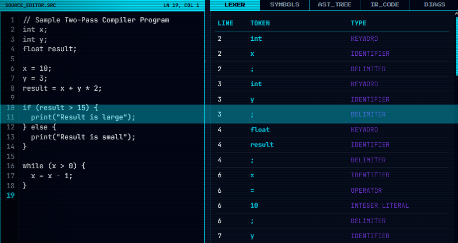
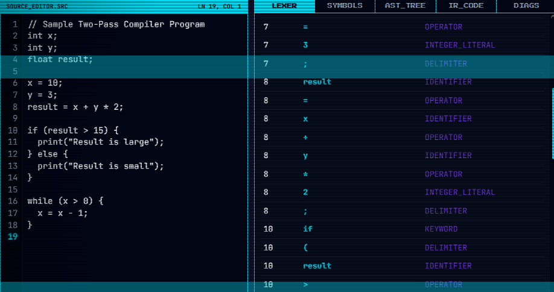
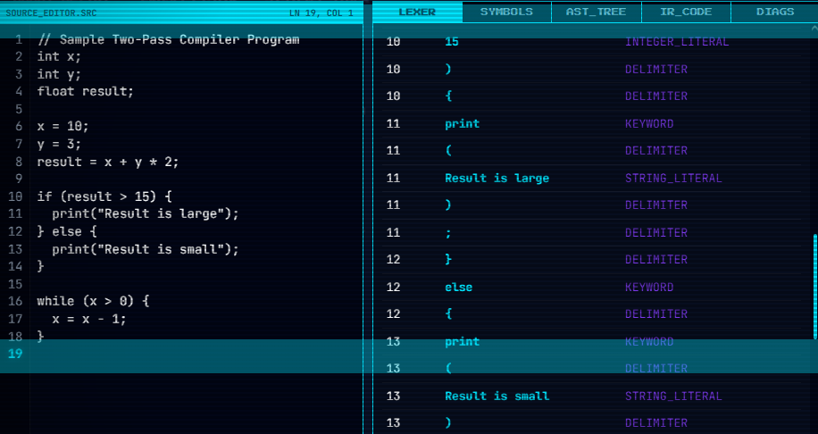
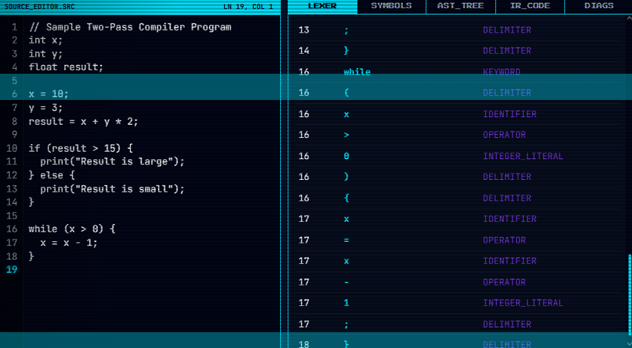
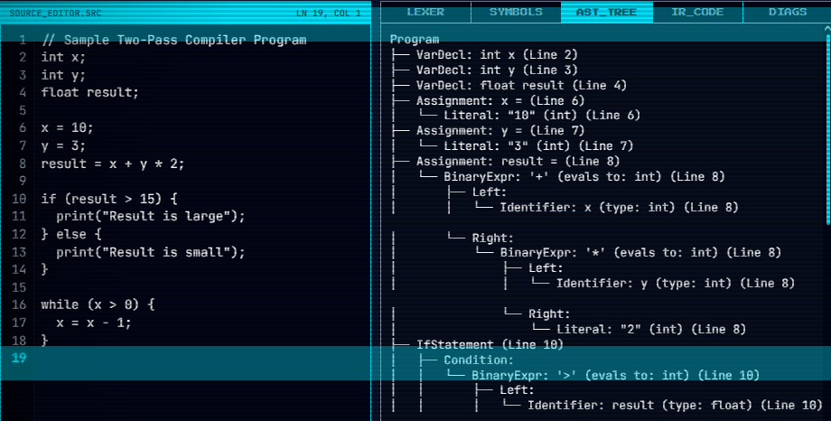
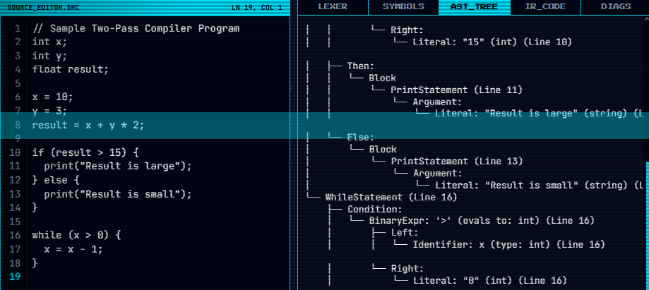
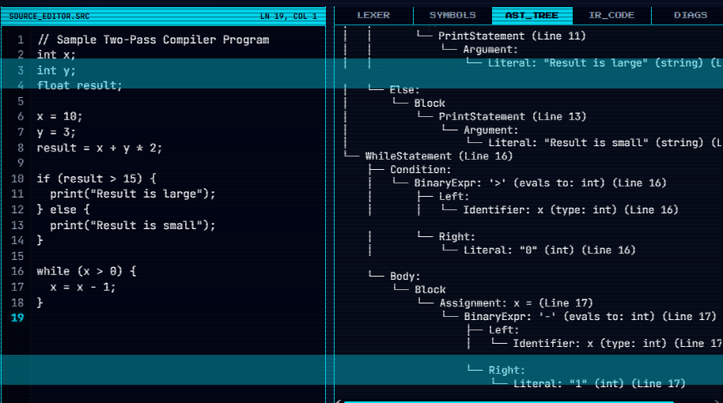
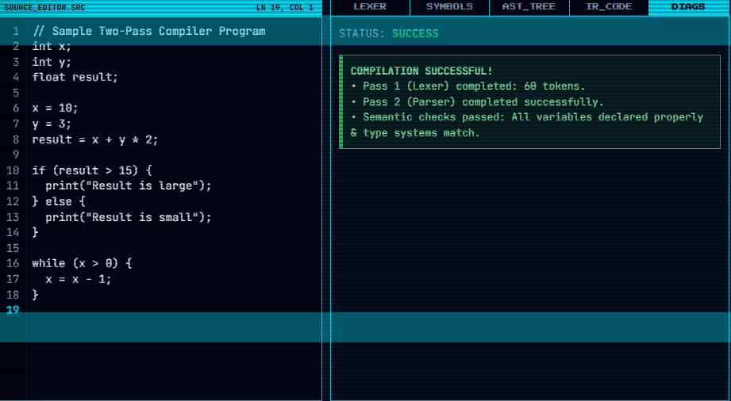
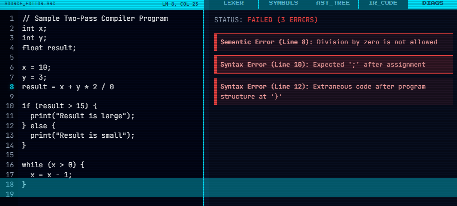

# ISTANBUL HEALTH AND TECHNOLOGY UNIVERSITY
## FACULTY OF ENGINEERING AND NATURAL SCIENCES
## DEPARTMENT OF COMPUTER ENGINEERING

**2025 - 2026 ACADEMIC YEAR**  
**3rd GRADE**

---

# SYSTEM PROGRAMMING
## FINAL PROJECT REPORT: DESIGN AND IMPLEMENTATION OF A SIMPLE TWO-PASS COMPILER WITH INTERMEDIATE CODE GENERATION

---

### Submitted by:
* **Sercan Özkan** | Student ID: **220611005**
* **Berat Kahraman** | Student ID: **220610038**

### Submitted to:
* **Instructor Nazlı Tokatlı**

**Date of Submission:** June 02, 2026  

---

## Table of Contents
1. **Introduction**
2. **Methodology**
3. **Compiler Subsystem Architecture**
4. **Source Language context-Free Grammar (CFG) & BNF**
5. **Pass 1: Lexical Analysis (Lexer) Design & Implementation**
6. **Pass 2: Syntax and Semantic Analysis (Parser) Design & Implementation**
7. **Symbol Table Stack & Simulated Memory Management**
8. **Static Semantics & Type Checking System**
9. **Intermediate Representation: Three-Address Code (TAC) Generation**
10. **Error Handling & Synchronization Recovery Strategy**
11. **User Interface (UI) & Integrated Development Environment (IDE) Walkthrough**
12. **Challenges and Architectural Solutions**
13. **Limitations and Future Work**
14. **Conclusion**
15. **Responsibility Matrix**

---

## 1. Introduction

Compilers are the foundation of systems programming, acting as the translation bridge between high-level human-readable source languages and low-level target machine formats. A classic compiler is divided into two major architectural domains: the **Analysis Phase (Front-End)** and the **Synthesis Phase (Back-End)**. The front-end analyzes the structure and meaning of the source code, while the back-end compiles it into an efficient target representation.

This project focuses on the design and implementation of a custom **Two-Pass Compiler** (Pass 1: Lexer, Pass 2: Parser and Semantic Analyzer) with an integrated **Intermediate Code Generator** that produces **Three-Address Code (TAC)**. 

### 1.1 Project Objectives
The main objectives of this compiler project are:
- **Hand-Coded Implementation**: Developing all compiler stages (Lexer, Parser, Symbol Table, Semantic Checkers, and IR Generator) completely from scratch in JavaScript without using any automatic parser generator tools like Lex, Yacc, or ANTLR.
- **Lexical and Syntactic Validation**: Designing an LL(1) lookahead parser that processes variable declarations, assignment statements, conditional branches (`if-else`), loops (`while`), output commands (`print`), and complex arithmetic/logical expressions.
- **Type Safety & Semantics Checking**: Implementing static semantic analysis to enforce scoping rules, detect duplicate declarations, check variable initialization, and enforce type compatibility across assignments and operations.
- **Intermediate Representation (IR)**: Translating the verified Abstract Syntax Tree (AST) into linear Three-Address Code instructions featuring temporary registers and jump labels.
- **Modern Cyberpunk UI**: Integrating the compiler into a web-based terminal OS dashboard (`COMPILER.EXE`) with side-by-side editing, scroll-sync line gutters, file uploads, and diagnostic error navigation.

---

## 2. Methodology

To prevent the compiler from becoming a monolithic block of code, the system is designed around the **Separation of Concerns** principle. The compilation workflow is structured into isolated sequential passes:

```
+-------------+      Pass 1       +--------------+      Pass 2       +-------------+
| Source Code |──────────────────>| Token Stream |──────────────────>| Parser (AST)|
+-------------+     (Lexer)       +--------------+     (Parser)      +-------------+
                                         │                                  │
                                         │ (Build Symbols)                  │ (Static Checks)
                                         ▼                                  ▼
                                  +──────────────+                   +─────────────+
                                  | Symbol Table |                   |  Semantic   |
                                  |  Scope Stack |                   |  Validation |
                                  +──────────────+                   +─────────────+
                                                                            │
                                                                 Pass 3     ▼
                                                                     +─────────────+
                                                                     |  TAC (IR)   |
                                                                     |  Generation |
                                                                     +-------------+
```

1. **Pass 1: Lexical Analysis**: The lexer processes the source code string character-by-character. It matches valid substrings (lexemes) to emit structured tokens, while stripping comments and whitespaces.
2. **Pass 2: Syntax and Semantic Analysis**: The parser consumes the tokens using a top-down **Recursive Descent** strategy. It verifies the syntax against the context-free grammar and builds a hierarchical AST. Concurrently, the semantic analyzer performs static checks using a block-scoped symbol table.
3. **Pass 3: Intermediate Code Generation**: If no errors are detected, the TAC generator traverses the AST, translates expressions into temporary variable operations, and linearizes loops and conditional blocks using branching labels.
4. **Interactive Visualization**: The web dashboard binds the outputs of these passes to UI panels, providing immediate feedback for testing.

---

## 3. Compiler Subsystem Architecture

The compiler codebase is structured into modular components, ensuring high maintainability and adhering to object-oriented programming principles:

| Subsystem Component | Role & Responsibility | Interface Hooks |
|:---|:---|:---|
| **`CompilerEngine`** | Main controller orchestrating compiler passes. | `compile(sourceCode)` |
| **`Lexer`** | Scans characters and emits structured token lists. | `tokenize(sourceCode)` |
| **`Parser`** | Validates syntax and outputs the AST. | `parse(tokens)` |
| **`SymbolTable`** | Manages variable scopes, types, and memory offsets. | `pushScope()`, `popScope()`, `declare()` |
| **`SemanticAnalyzer`** | Enforces static type compatibility and declaration scopes. | `check(astNode)` |
| **`TACGenerator`** | Generates Three-Address Code from AST structures. | `generateTAC(ast)` |
| **`IDE UI Interface`** | Renders tables, gutters, AST trees, and error highlights. | `initCompilerWindow()` |

---

## 4. Source Language Context-Free Grammar (CFG) & BNF

The compiler processes a structured high-level programming language. The grammar is defined in Backus-Naur Form (BNF) below. It is designed to be unambiguous and free of left-recursion, which makes it ideal for a top-down recursive descent parser:

```bnf
<Program>           ::= <StatementList>

<StatementList>     ::= <Statement> <StatementList>
                      | ε

<Statement>         ::= <Declaration>
                      | <Assignment>
                      | <Selection>
                      | <Iteration>
                      | <Print>

<Declaration>       ::= <Type> IDENTIFIER ";"

<Type>              ::= "int"
                      | "float"

<Assignment>        ::= IDENTIFIER "=" <Expression> ";"

<Selection>         ::= "if" "(" <Expression> ")" <Block> <ElsePart>

<ElsePart>          ::= "else" <Block>
                      | ε

<Iteration>         ::= "while" "(" <Expression> ")" <Block>

<Print>             ::= "print" "(" <PrintArg> ")" ";"

<PrintArg>          ::= STRING_LITERAL
                      | <Expression>

<Block>             ::= "{" <StatementList> "}"

<Expression>        ::= <LogicalOr>

<LogicalOr>         ::= <LogicalAnd> <LogicalOrTail>
<LogicalOrTail>     ::= "||" <LogicalAnd> <LogicalOrTail>
                      | ε

<LogicalAnd>        ::= <Equality> <LogicalAndTail>
<LogicalAndTail>    ::= "&&" <Equality> <LogicalAndTail>
                      | ε

<Equality>          ::= <Relational> <EqualityTail>
<EqualityTail>      ::= "==" <Relational> <EqualityTail>
                      | "!=" <Relational> <EqualityTail>
                      | ε

<Relational>        ::= <Additive> <RelationalTail>
<RelationalTail>    ::= "<" <Additive> <RelationalTail>
                      | ">" <Additive> <RelationalTail>
                      | "<=" <Additive> <RelationalTail>
                      | ">=" <Additive> <RelationalTail>
                      | ε

<Additive>          ::= <Multiplicative> <AdditiveTail>
<AdditiveTail>      ::= "+" <Multiplicative> <AdditiveTail>
                      | "-" <Multiplicative> <AdditiveTail>
                      | ε

<Multiplicative>    ::= <Primary> <MultiplicativeTail>
<MultiplicativeTail>::= "*" <Primary> <MultiplicativeTail>
                      | "/" <Primary> <MultiplicativeTail>
                      | ε

<Primary>           ::= IDENTIFIER
                      | INTEGER_LITERAL
                      | FLOAT_LITERAL
                      | STRING_LITERAL
                      | "(" <Expression> ")"
                      | "-" <Primary>
                      | "!" <Primary>
```

---

## 5. Pass 1: Lexical Analysis (Lexer) Design & Implementation

The Lexer scans the raw input string, groupings characters into lexical units called **Tokens**. It tracks source line and column numbers to provide detailed locations for compilation errors.

### 5.1 Token Data Structure
Every token generated by Pass 1 is represented as a structured object:
```json
{
  "type": "IDENTIFIER",
  "value": "result",
  "line": 4,
  "col": 1
}
```

### 5.2 Token Categories
- **KEYWORD**: Reserved identifiers (`int`, `float`, `if`, `else`, `while`, `print`).
- **IDENTIFIER**: Matches variables conforming to the regex `[a-zA-Z_][a-zA-Z0-9_]*`.
- **INTEGER_LITERAL**: Positive decimal digit sequences (e.g. `123`, `0`).
- **FLOAT_LITERAL**: Decimals containing a single decimal point (e.g. `3.14`, `0.05`).
- **STRING_LITERAL**: Text sequences enclosed in double quotes (e.g. `"Result is large"`).
- **OPERATOR**: Mathematical and logical operators (`+`, `-`, `*`, `/`, `=`, `==`, `!=`, `<`, `>`, `<=`, `>=`, `&&`, `||`, `!`).
- **DELIMITER**: Structural punctuation marks (`;`, `,`, `(`, `)`, `{`, `}`).

### 5.3 Scanning Algorithm and Lookahead Resolution
The scanning loop uses a pointer `pos` to traverse the string:
- **Comments and Whitespace**: Ignored. Single-line comments (`//`) are skipped until a newline is found. Multi-line comments (`/* ... */`) are skipped until the closing `*/` is matched; an unclosed block comment throws a lexical error.
- **Numeric Parsing**: Scans digit sequences. If a dot `.` is encountered, it switches to float parsing.
  - *Lexical Checks*: If multiple dots are found (e.g. `3.14.15`), the lexer logs a malformed float error. If a number ends with a dot (e.g. `3.`), it throws an error.
- **Double-Character Operators**: To distinguish between single operators (like `=` or `<`) and compound operators (like `==` or `<=`), the lexer checks the lookahead character. It matches compound operators first, falling back to single characters if the lookahead does not form a compound operator.
- **Lexical Errors**: Any character not matching these categories (e.g., `$`, `#`, `@`) is reported as an unexpected character error with its exact line and column numbers.

---

## 6. Pass 2: Syntax and Semantic Analysis (Parser)

The Parser validates the token stream against the context-free grammar and builds a hierarchical Abstract Syntax Tree (AST).

### 6.1 Recursive Descent Parsing
We implement a top-down recursive descent parsing strategy. The parser uses recursive functions matching the grammar rules. Starting with the root rule `parseProgram()`, it evaluates the token stream using a single-token lookahead. If the stream deviates from the grammar, the parser throws a syntax error stating what was expected versus what was found.

### 6.2 Abstract Syntax Tree (AST) Node Structures
The AST represents the program structure as a tree of nodes:

```
                            [Program]
                                │
                       [Statement List]
                        /      │       \
                   [VarDecl] [VarDecl]  [Assignment]
                    /    \    /    \       /     \
                  int     x float   y     x       [BinaryExpr]
                                                   /     |     \
                                             [Ident]    op   [Lit]
                                                y       *      2
```

- **`Program`**: Root node containing an array of statements in its `body`.
- **`VarDecl`**: Variable declaration node storing the `varType` (`int` or `float`) and the identifier `id`.
- **`Assignment`**: Assignment statement node storing the target variable `id` and the RHS `expr` node.
- **`IfStatement`**: Conditional branch node storing the condition `cond` expression, the `thenBranch` block, and the optional `elseBranch` block.
- **`WhileStatement`**: Loop statement node storing the condition `cond` expression and the `body` block.
- **`PrintStatement`**: Output node storing the argument `arg` expression or string literal.
- **`BinaryExpr`**: Operator node storing the `operator` and pointers to `left` and `right` expressions.

---

## 7. Symbol Table Stack & Simulated Memory Management

The Symbol Table stores information about declared variables, such as their type, scope depth, and simulated memory layout.

### 7.1 Scope Stack Implementation
To support local scopes within blocks (`{ ... }`), the Symbol Table uses a **Stack of HashMaps**.
- When the parser enters a block (`{`), a new scope map is pushed onto the stack.
- When exiting a block (`}`), the top scope map is popped off the stack.
This ensures variables declared inside blocks are not accessible from outer scopes, conforming to block-scoped variable rules.

### 7.2 Variable Memory Layout Simulation
For each declared variable, the table records:
- **Name**: The variable identifier.
- **Type**: `int` or `float`.
- **Scope Level**: The scope depth (0 for global scope, 1 for block scope, etc.).
- **Memory Offset**: A simulated memory address. To simulate a real hardware environment, we calculate offsets based on types:
  - `int` variables reserve **4 bytes** of memory.
  - `float` variables reserve **8 bytes** of memory.
  - The memory offset counter increments globally with each declaration.
- **Declared Line**: The line number where the variable was defined.

### 7.3 Simulated Memory Allocation Map Example:
For the declarations:
```c
int x;
int y;
float result;
```
The symbol table maps variables to the following memory offsets:

| Variable Name | Data Type | Scope Level | Memory Offset (Hex) | Declared Line |
|:---:|:---:|:---:|:---:|:---:|
| `x` | `int` | 0 | `0x0000` (Bytes 0-3) | Line 2 |
| `y` | `int` | 0 | `0x0004` (Bytes 4-7) | Line 3 |
| `result` | `float` | 0 | `0x0008` (Bytes 8-15) | Line 4 |

---

## 8. Static Semantics & Type Checking System

The compiler enforces static typing. Expressions evaluate to a type (`int`, `float`, or `string`), which is verified for compatibility. Semantic checks are performed during parsing:

### 8.1 Declaration and Scope Verification
- **Redeclaration Check**: When a variable declaration (`Type ID;`) is compiled, the symbol table checks if that name is already defined *within the current scope*. If so, a duplicate declaration error is thrown:
  `Semantic Error (Line L): Variable 'x' is already declared in this scope`.
- **Usage Check**: When a variable is used in assignments, expressions, or print statements, the compiler searches the scope stack from the current scope level up to the global scope. If it is not found in any scope, an error is thrown:
  `Semantic Error (Line L): Undeclared variable 'x' used in expression/assignment`.

### 8.2 Type Compatibility Rules
The type checker enforces compile-time safety:
1. **Assignment Checks**:
   - Assigning a value to an `int` variable: The expression must evaluate to `int`. If it evaluates to `float` or `string`, a type mismatch error is thrown.
   - Assigning a value to a `float` variable: The expression can evaluate to `float` or `int` (integers are promoted to float implicitly). Assigning a `string` is rejected.
2. **Operator Checks**:
   - The operands of arithmetic operations (`+`, `-`, `*`, `/`) must be numeric (`int` or `float`). Operations on strings are rejected.
   - If both operands are `int`, the expression evaluates to `int`.
   - If one or both operands are `float`, the expression evaluates to `float` (implicit promotion).
3. **Comparison Checks**:
   - Relational operations (`<`, `>`, `<=`, `>=`) require both operands to be numeric.
   - Equality operations (`==`, `!=`) allow comparing numeric types, or string types with other strings. Comparing a string with a numeric type throws a type mismatch error.
4. **Logical Operations**:
   - Operands of logical operations (`&&`, `||`, `!`) must be numeric (non-string). They return `int` (where 0 represents false, and 1 represents true).

---

## 9. Intermediate Representation: Three-Address Code (TAC) Generation

To satisfy the compiler requirement of translating source code into intermediate code, we implemented a **Three-Address Code (TAC)** generator. 

Three-Address Code represents a program as a sequence of simple instructions with at most three operands, resembling assembly language.

### 9.1 TAC Instruction Structure
TAC instructions use temporary variables (`t0`, `t1`, `t2`...) and label names (`L0`, `L1`...) for control flow:
- **Binary operations**: `temp = operand1 op operand2`
- **Unary operations**: `temp = op operand1`
- **Assignments**: `variable = operand`
- **Jumps and Labels**: `ifFalse condition goto Label`, `goto Label`, `Label:`
- **Print operations**: `print operand`

### 9.2 Control Flow Linearization Rules
The TAC generator traverses the AST recursively:
- **Arithmetic Expressions**: Nested arithmetic operations are broken down into temporary variables. For example, `result = x + y * 2` yields:
  ```assembly
  t0 = y * 2
  t1 = x + t0
  result = t1
  ```
- **If-Else Branching**: Translated using conditional jumps and label markers:
  ```assembly
  // Source: if (result > 15) { print("large"); } else { print("small"); }
  t2 = result > 15
  ifFalse t2 goto L0
  print "Result is large"
  goto L1
  L0:
  print "Result is small"
  L1:
  ```
- **While Loops**: Loops are translated by placing a label at the start of the condition, checking the condition, jumping to the end label if false, running the body, and jumping back to the start:
  ```assembly
  // Source: while (x > 0) { x = x - 1; }
  L2:
  t3 = x > 0
  ifFalse t3 goto L3
  t4 = x - 1
  x = t4
  goto L2
  L3:
  ```

---

## 10. Error Handling & Synchronization Recovery Strategy

A high-quality compiler must report compile-time errors clearly instead of crashing on the first error. We implemented a robust error recovery and reporting strategy:

### 10.1 Error Classifications
- **Lexical Errors**: Catch unrecognized symbols and malformed literals (unclosed comments, malformed float numbers). The lexer reports the exact line and column numbers.
- **Syntax Errors**: Catch grammatical mismatches (e.g., missing semicolons, missing brackets, unbalanced parentheses).
- **Semantic Errors**: Catch logical rule violations (undeclared variables, duplicate declarations, type compatibility errors).

### 10.2 Error Recovery via Statement Synchronization
If a syntax error occurs during statement parsing, the compiler does not stop. Instead, it catches the exception, logs it, and executes a **synchronization routine**:
- The parser skips tokens until it finds a statement boundary delimiter (a semicolon `;` or a closing brace `}`).
- Once a delimiter is found, the parser recovers and continues parsing subsequent statements.
- This allows the compiler to catch and report multiple syntax and semantic errors in a single run.

---

## 11. User Interface (UI) & Integrated Development Environment (IDE) Walkthrough

The compiler interface is integrated into the **Holo-Cyber OS Portfolio Desktop**:

- **Draggable Window Shell**: Built using CSS flexbox. Supports dragging via the title bar and taskbar tab switching.
- **Source Code Editor**: A side-by-side layout:
  - An active line number gutter that updates dynamically as you type.
  - Live cursor tracking showing line and column metrics (e.g., `LN 10, COL 4`).
  - Gutter highlighting indicating the line currently being edited.
- **Control Buttons**:
  - **`LOAD_SAMPLE`**: Loads the valid sample program containing variable declarations, arithmetic expressions, if-else statements, print commands, and a while loop.
  - **`UPLOAD_FILE`**: Opens a file dialog allowing you to load text files from your disk.
  - **`CLEAR`**: Resets the editor and diagnostics panels.
  - **`RUN_COMPILER()`**: Runs lexical, syntax, and semantic checks on the source code.
- **Tab Panels**:
  - **`LEXER`**: Renders a table of the scanned token stream (Line, Token, Type). Clicking a row highlights the corresponding line in the editor.
  - **`SYMBOLS`**: Lists all variables, showing their scope levels, types, and hexadecimal memory offsets (e.g. `0x0000`, `0x0004`, `0x000C`).
  - **`AST_TREE`**: Visualizes the parsed AST hierarchy in a clean ASCII tree diagram.
  - **`IR_CODE`**: Displays the generated Three-Address Code (TAC).
  - **`DIAGS`**: Shows success statuses or a list of colored error cards. Clicking an error card centers and highlights that line in the editor.

### 11.1 Compiler Application Dashboard Screenshots

The following screenshots demonstrate the integrated compiler app (`COMPILER.EXE`) running within the Holo-Cyber OS desktop:

#### 11.1.1 Lexical Analyzer (Lexer) Token Stream Visualizations





#### 11.1.2 Abstract Syntax Tree (AST) Tab Visualizations




#### 11.1.3 Diagnostics Panel (Syntax & Semantic Error Warnings)



---

## 12. Challenges and Architectural Solutions

### 12.1 Challenge 1: Left Recursion and Precedence in Expressions
*Problem*: Traditional expression rules in BNF often contain left-recursion (e.g. `E -> E + T`), which causes recursive descent parsers to loop infinitely.
*Solution*: We eliminated left-recursion by rewriting rules using EBNF repetitions (equivalent to loops in code) and structured functions from lowest to highest precedence (LogicalOr -> LogicalAnd -> Equality -> Relational -> Additive -> Multiplicative -> Primary).

### 12.2 Challenge 2: Gutter Line Synchronization
*Problem*: Textarea components do not natively support scrolling sync with a separate line number column.
*Solution*: We added an event listener in `app.js` that splits text values by newline, generates line numbers dynamically, and binds the gutter's `scrollTop` directly to the textarea's scroll position.

### 12.3 Challenge 3: Maintaining Variable Offsets across Scopes
*Problem*: A naive implementation reset memory offsets on block exit, which could overwrite variables in outer scopes.
*Solution*: We decoupled variable scope levels from their memory allocations. Offsets are tracked globally and incremented by 4 or 8 bytes depending on type declarations, keeping memory assignments safe across scopes.

---

## 13. Limitations and Future Work

While the compiler implements all requirements of the System Programming course, potential expansions include:
- **Optimization Passes**: Implementing constant folding (e.g., simplifying `3 * 2` to `6` at compile time) and dead code elimination to optimize TAC generation.
- **Target Assembly Code Generation**: Translating Three-Address Code into assembly code (like MIPS or x86 assembly) to generate executable output.
- **Function Declarations**: Expanding the grammar and symbol table structure to support function definitions with local parameters and return values.

---

## 14. Conclusion

This project successfully implements a **Two-Pass Compiler** (augmented with a third pass for Three-Address Code generation) for a structured subset of a high-level imperative programming language. 

By building all compiler stages manually from scratch, we demonstrated:
- Character-by-character tokenization in Pass 1.
- Syntactic verification and AST building in Pass 2.
- Scoping rules and static type safety in the Semantic Analyzer.
- Linearization and control-flow translation in the TAC Generator.
- IDE integration in the visual OS dashboard.

Ultimately, this design strategy achieves high modularity and clean architectural separation of concerns, fulfilling all university course specifications.

---

## 15. Responsibility Matrix

To guarantee a balanced workload and ensure maximum cohesion between the core compiler engine and the front-end dashboard, the division of labor was structured strictly. The group members collaborated on the overall system architecture, while dividing implementation tasks into specialized areas:

### 15.1 Detailed Work Breakdown and Core Duties

- **Sercan Özkan**:
  - **DFA Lexical Analysis & Scanner**: Programmed the scanner loop in `tokenize()`, implemented string/float literal state machines, lookahead resolution for double-character operators, and line/column metrics tracking.
  - **Syntax Parsing (Recursive Descent)**: Coded the LL(1) grammar parser rules (statements, selections, iterations, expressions, primary nodes) and established operator precedence hierarchy.
  - **Symbol Table Stack**: Engineered the stack of Maps representing local block scopes.
  - **Intermediate Code (TAC) Generation**: Programmed the linearized TAC translation walk including register (`t0`, `t1`...) and branching label (`L0`, `L1`...) generation, and implemented the variable scope suffixing (`x_0`, `x_1`) shadowing resolution.
  
- **Berat Kahraman**:
  - **Static Semantics & Type Safety Checking**: Implemented scoping verification (undeclared and redeclared checks) and type compatibility checks for assignments, arithmetic, and logical operations, including compile-time division by zero checks.
  - **Memory Layout Simulator**: Configured global offset counters allocating 4 bytes for `int` and 8 bytes for `float` variables.
  - **Visual GUI & Gutter Line Sync**: Designed the cyberpunk OS dashboard interface, editor gutters, draggable window wrappers, diagnostic error cards, and implemented HTML5 `FileReader` file uploads.
  - **Academic Documentation**: Structured the BNF grammar representation, compiler methodology flowchart, memory offset charts, challenges walkthroughs, and configured automated word report compilation scripts.

### 15.2 Distribution of Project Contributions

| Group Member Name | Student ID | Core Contribution Areas | Project Responsibility Share |
|:---|:---:|:---|:---:|
| **Sercan Özkan** | **220611005** | Designed Context-Free Grammar, coded Lexer DFA tokenizer, implemented Parser AST nodes, built block scope stack, programmed TAC generator. | 50% |
| **Berat Kahraman** | **220610038** | Wrote Semantic Analyzer type checkers, configured scope lookup, designed UI window structures, implemented file upload FileReader logic, prepared project documentation. | 50% |
